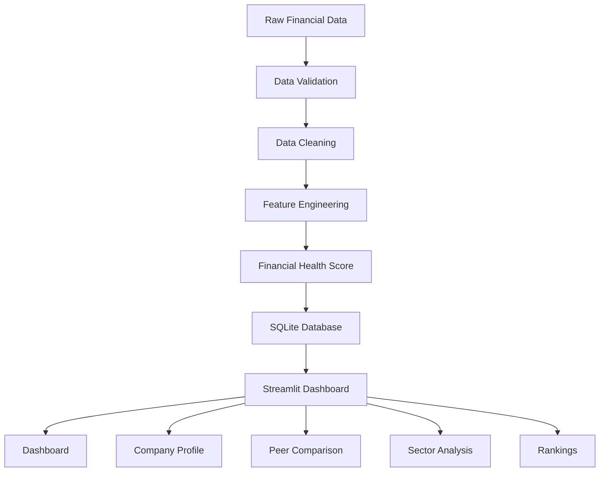

# 📊 N100 Financial Intelligence Platform

> A production-grade Financial Intelligence Platform for analyzing **Nifty 100 companies** using financial statements, feature engineering, custom scoring models, and interactive business intelligence dashboards.

<p align="center">


</p>

---


# 🚀 Project Overview

The **N100 Financial Intelligence Platform** is an end-to-end financial analytics application that transforms raw financial statement data into meaningful business insights.

The platform performs data preprocessing, feature engineering, financial health scoring, and interactive visualization to help users evaluate companies, compare peers, analyze sectors, and identify top-performing businesses.

Designed with a modular architecture, the project demonstrates a complete data science workflow—from raw data ingestion to deployment.

---


# 🎯 Business Problem

Analyzing listed companies requires evaluating multiple financial metrics such as profitability, valuation, leverage, and capital efficiency. Comparing companies across sectors manually is time-consuming and often leads to inconsistent decisions.

This project addresses these challenges by consolidating financial data into a single analytics platform that enables investors, analysts, researchers, and students to compare companies, identify strong performers, analyze sectors, and make data-driven financial decisions through interactive dashboards.

---


# 📊 Dashboard Modules

## 🏠 Home

Project overview, platform objectives, quick insights, and technology stack.

## 📈 Dashboard

- Executive KPIs
- Financial Health Distribution
- Top & Bottom Companies
- Sector Performance
- Bubble Charts
- Treemap
- Executive Insights

## 🏢 Company Profile

- Company Overview
- Financial Metrics
- Health Gauge
- Financial Ratio Analysis
- Similar Companies
- Executive Summary

## 🤝 Peer Comparison

- Side-by-Side Company Comparison
- Radar Chart
- KPI Comparison
- Profitability Analysis
- Valuation Comparison
- Category Winners

## 🏭 Sector Analysis

- Sector Summary
- Average Financial Health
- Profitability Comparison
- Market Capitalization Analysis
- Treemap
- Performance Matrix

## 🏆 Rankings

- Top & Bottom Companies
- ROE Rankings
- ROCE Rankings
- Valuation Rankings
- Market Leaders

---


# ✨ Key Features

- 📂 Automated Data Loading & Validation
- 🧹 Data Cleaning & Preprocessing Pipeline
- ⚙️ Feature Engineering
- 🧠 Custom Financial Health Score
- 📈 Executive Dashboard
- 🏢 Company Profile Analysis
- 🤝 Peer Comparison
- 🏭 Sector Analysis
- 🏆 Company Rankings
- 📊 Interactive Plotly Visualizations
- 💾 SQLite Database Integration
- 🌐 Streamlit Web Application

---


# 📌 Key Insights

The platform enables users to quickly answer questions such as:

- Which companies have the strongest financial health?
- Which sectors outperform others on average?
- Which companies generate the highest ROE and ROCE?
- Which companies have high leverage risk?
- How do peers compare across multiple financial metrics?
- Which companies lead in market capitalization and valuation?
- Which companies consistently rank among the top performers?

---


# 🧠 Financial Health Score

A custom composite score developed to evaluate the overall financial strength of a company using multiple financial indicators.

### Metrics Used

- Return on Equity (ROE)
- Return on Capital Employed (ROCE)
- Debt-to-Equity Ratio
- Price-to-Earnings Ratio
- Book Value
- Market Capitalization

Higher scores indicate stronger overall financial performance.

---


# 🏗️ Project Architecture



---


# 🛠 Tech Stack

| Category | Technologies |
|----------|--------------|
| Programming | Python |
| Data Analysis | Pandas, NumPy |
| Visualization | Plotly |
| Dashboard | Streamlit |
| Database | SQLite |
| Reporting | ReportLab |
| Testing | PyTest |

---


# 📁 Project Structure

```text
N100_FINANCIAL_INTELLIGENCE_PLATFORM/

├── assets/
├── components/
├── dashboards/
├── data/
├── db/
├── docs/
├── notebooks/
├── output/
├── pages/
├── reports/
├── src/
├── tests/
│
├── app.py
├── main.py
├── requirements.txt
├── README.md
└── LICENSE
```

---

# 📂 Dataset

The project uses financial data of **Nifty 100 companies**, including:

- Financial Statements
- Profit & Loss
- Balance Sheet
- Cash Flow
- Financial Ratios
- Market Capitalization
- Sector Information
- Stock Prices

---


# 📈 Project Statistics

| Metric | Value |
|---------|------:|
| Companies Analyzed | 92 |
| Sectors Covered | 10 |
| Dashboard Pages | 5 |
| Financial Metrics | 20+ |
| Interactive Charts | 35+ |
| Processed Records | 6,900+ |
| Database | SQLite |
| Deployment | Streamlit Cloud |

---

# ▶️ Installation

```bash
git clone https://github.com/Bhardwaj-Arin/N100_FINANCIAL_INTELLIGENCE_PLATFORM.git

cd N100_FINANCIAL_INTELLIGENCE_PLATFORM

pip install -r requirements.txt

streamlit run app.py
```

---

# 🌐 Live Demo

🚀 **Streamlit Application**

https://n100financialintelligenceplatform-njqenrfxgue6evxbdjcgmj.streamlit.app/

---


# 📸 Dashboard Preview

## 🏠 Home


---

## 📈 Dashboard


---

## 🏢 Company Profile


---

## 🤝 Peer Comparison


---

## 🏭 Sector Analysis


---

## 🏆 Rankings


---


# 🌟 Project Highlights

- Developed a custom Financial Health Score using multiple financial indicators.
- Built an end-to-end data pipeline from raw financial statements to interactive dashboards.
- Designed five business intelligence modules for company, sector, and peer analysis.
- Implemented modular project architecture with reusable components.
- Deployed the application using Streamlit Community Cloud.
- Automated reporting and export of processed analytical datasets.

---


# 🔮 Future Improvements

- Live Stock Market APIs
- Portfolio Tracking
- AI-Powered Financial Insights
- PDF Report Generation
- User Authentication
- Real-Time Market Dashboard

---


# 👨‍💻 Author

**Arin Bhardwaj**

M.Sc. Mathematics & Scientific Computing  
National Institute of Technology (NIT) Warangal

- GitHub: https://github.com/Bhardwaj-Arin

---

# ⭐ Support

If you found this project useful, consider giving it a **⭐ Star** on GitHub.